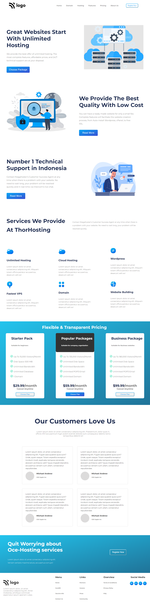

# Project-11
Web Hosting landing page

Creating a webpage for a Web Hosting Firm

Hands-on Experience:
- Flexbox - 'Extensive Usage'
  - Display type
  - Justify content
  - Flex direction
  - Align content
  - Align Items
- Pseudo elements
  - Before
  - After
- Pseudo selectors
  - Hover
- Transitions
  - Delay
  - Ease-in, Ease-out
- SVG files Handling
  - Introduction to Figma
  - Image separation

